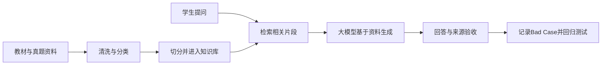

# 专业考试知识库问答MVP｜脱敏产品案例

> 本页面是实习项目的脱敏案例说明。因项目属于公司内部实践，无法公开原始资料、工作流配置、代码和业务数据。内容仅用于说明本人参与的产品工作与反思。

## 项目概述

该项目主要服务于建筑类考试的备考学生。团队在日常答疑场景中发现，学生会重复咨询教材知识点、真题出处和题目理解等问题，相似问题需要人工重复处理，也难以即时覆盖所有学生的提问。

项目希望搭建一个基于指定教材和真题资料的知识库问答MVP：先从指定资料中检索相关内容，再由大模型结合检索结果生成回答，并尽量提供可核对的来源。

## 为什么不是直接使用通用大模型

该项目更关注：

- 回答是否基于指定资料；
- 教材与真题出处是否可以追溯；
- 资料不足时是否控制回答边界。

FAQ可以承接特别固定的问题，但学生对同一知识点存在不同的口语化表达，部分问题还需要从资料中定位和组织答案，因此项目采用知识库检索与大模型生成结合的方式。

## 基本工作流

## 我的参与范围

- 清理和整理项目资料；
- 整理典型Query及不同表达方式；
- 参与低代码知识库工作流测试；
- 检查回答内容与资料是否一致；
- 检查引用来源是否对应；
- 记录Bad Case，并协助验证调整结果。

## 测试问题类型

MVP阶段主要覆盖以下问题：

1. 教材中可以直接找到答案的问题；
2. 涉及真题及出处的问题；
3. 同一知识点的口语化或改写表达；
4. 容易混淆的相近概念；
5. 知识库内没有答案的问题。

## Bad Case排查思路

出现错误回答后，按照以下顺序检查：

1. 资料库中是否存在正确答案；
2. 系统是否正确理解用户问题；
3. 是否召回相关资料片段；
4. 回答是否忠于召回资料；
5. 引用来源是否与结论对应；
6. 资料不足时是否出现越界回答。

## 一个典型问题：口语化表达与专业术语不一致

例如学生可能问“这个建筑长什么样”，而教材中使用“形式特征”“立面特征”或“造型特点”等表达。测试时需要观察系统能否通过学生的日常说法检索到使用专业术语描述的资料。

项目当时主要通过人工整理典型问法和对应概念，再进行测试与调整；进一步可以考虑同义词词表、Query改写、向量检索和重排序等方法。

## 指标口径说明

项目曾使用一批典型问题进行内部抽样验收，主要检查回答是否与知识库资料一致、引用出处是否对应，以及是否存在明显答非所问。

如果重新评估，我会：

- 固定测试集版本与问题分类；
- 明确每项验收标准；
- 分别记录检索、回答、引用和边界表现；
- 保留固定回归集与新增Bad Case集；
- 报告可复现的测试结果，而不是笼统的准确率。

## 项目反思

这个项目让我认识到，RAG产品的工作并不只是连接知识库和大模型。真正影响可用性的还有资料质量、问题表达、检索结果、生成约束、来源追溯和无答案边界。

同时，需求依据也应进一步数据化：除了团队和老师的答疑经验，还应分析真实咨询记录、问题类型和重复频次，并通过学生访谈确认问题的实际影响。

